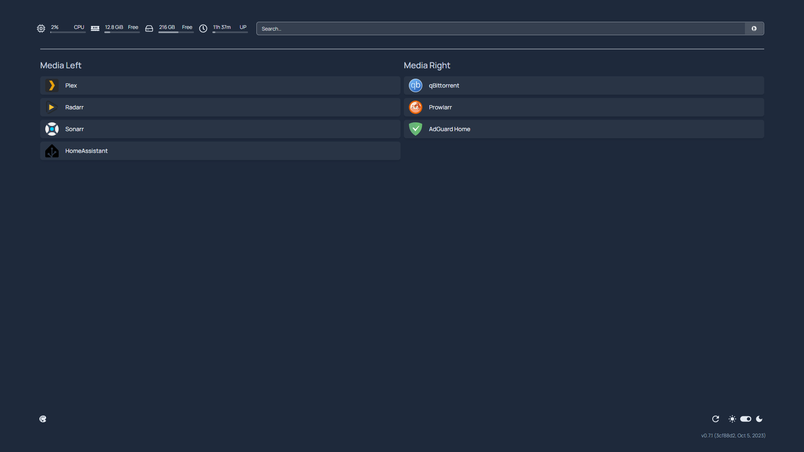
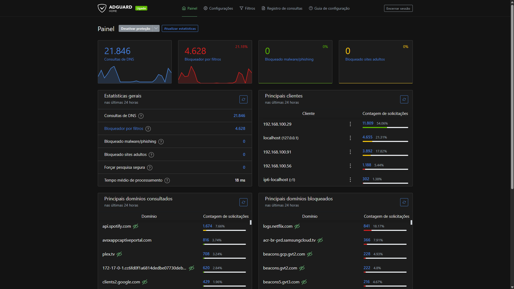

# 🏠 My Homelab Architecture

Repositório dedicado à documentação da minha infraestrutura pessoal rodando em Ubuntu Server. Este projeto serve como meu ambiente de testes para Docker, automação residencial e gestão de serviços de rede.

## 🛠️ Hardware & SO

* **Host:** Dell Latitude 3420 (Notebook como servidor)
* **CPU:** 11th Gen Intel i7-1165G7 (8 cores) @ 4.700GHz
* **RAM:** 16GB DDR4
* **Armazenamento:** 500GB SSD NVMe
* **SO:** Ubuntu 24.04.3 LTS (Noble Numbat)
* **Kernel:** 6.8.0-101-generic

---

## 📸 Visual Stack & Dashboards

Abaixo, os painéis de controle que utilizo para gerenciar e monitorar o ecossistema do Homelab.

### 1. Dashboard Principal (Homepage)
Ponto de entrada único para todos os serviços hospedados no servidor, organizado por categorias (Media, Services, etc).


### 2. Gestão de Rede & DNS (AdGuard Home)
Monitoramento de tráfego, filtros de privacidade e bloqueio de anúncios em nível de rede.


### 3. Central de Automação (Home Assistant - Desktop)
Interface administrativa para controle de iluminação, dispositivos inteligentes e monitoramento de sistema.


### 4. Interface Mobile (Home Assistant)
Otimização para controle via smartphone, com foco em usabilidade e acesso rápido.


---

## 🐋 Docker Stack & Services

A infraestrutura é dividida em stacks modulares localizadas na pasta `/compose`.

| Stack | Serviços Principais | Finalidade |
| :--- | :--- | :--- |
| **Network** | AdGuard Home | DNS Sinkhole e Segurança de rede |
| **Media** | Radarr, Sonarr, Prowlarr, FlareSolverr | Automação e gestão de biblioteca de mídia |
| **Automation** | Home Assistant, Go2RTC | Central de automação e câmeras IP |
| **Dashboard** | Homepage | Interface visual de navegação |

---

## 📐 Topologia Lógica (Mermaid)

```mermaid
graph TD
    User((Usuário)) --> Dashboard[Homepage]
    
    subgraph "Segurança & Rede"
        AdGuard[AdGuard Home - DNS]
        Tailscale[Tailscale VPN]
    end

    subgraph "Gestão de Mídia"
        Radarr
        Sonarr
        Prowlarr
        FlareSolverr
    end

    subgraph "Automação"
        HA[Home Assistant]
        Go2RTC[Gestão de Câmeras]
    end

    Dashboard --> HA
    Dashboard --> Radarr
    Dashboard --> AdGuard
    Prowlarr --> FlareSolverr
    Radarr & Sonarr --> Prowlarr
