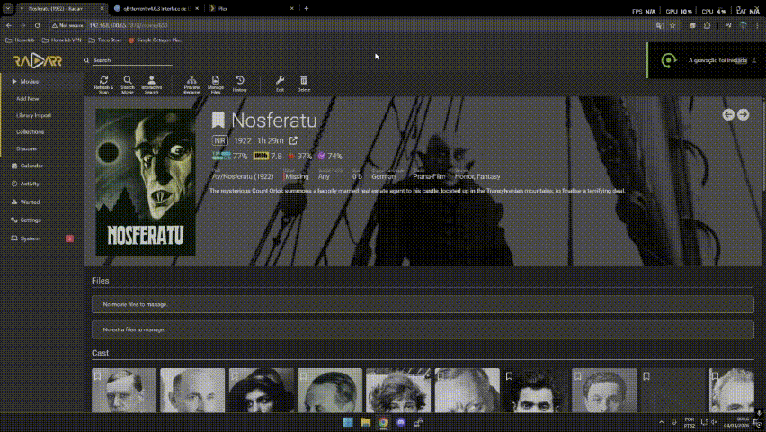
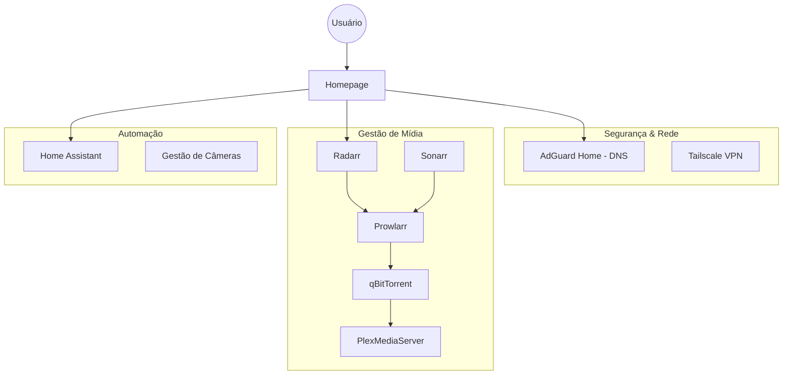

# My Homelab Architecture

Repositório dedicado à documentação da minha infraestrutura pessoal rodando em Ubuntu Server. Este projeto serve como meu ambiente de testes para Docker, automação residencial e gestão de serviços de rede.

## Hardware & SO

* **Host:** Dell Latitude 3420 (Notebook como servidor)
* **CPU:** 11th Gen Intel i7-1165G7 (8 cores) @ 4.700GHz
* **RAM:** 16GB DDR4
* **Armazenamento:** 500GB SSD NVMe, 500GB HD
* **SO:** Ubuntu 24.04.3 LTS (Noble Numbat)
* **Kernel:** 6.8.0-101-generic

---

## O Projeto: Motivação e Implementação

Este projeto nasceu com o objetivo de aprimorar minhas habilidades técnicas e otimizar rotinas do dia a dia através da cultura Self-Hosted.

Ecossistema de Mídia e Entretenimento
O foco inicial foi a centralização de mídia na rede doméstica. Utilizando o Plex Media Server, consegui uma interface visualmente agradável e eficiente, compatível inclusive com sistemas fechados como a Roku TV. Para tornar o fluxo autônomo, estruturei uma stack composta por qBittorrent, Prowlarr, Radarr e Sonarr.

Nesta arquitetura, o Prowlarr gerencia os indexadores que alimentam o Radarr e o Sonarr. Ao solicitar um título (ex: 'Nosferatu'), o sistema localiza o arquivo, envia o comando para o qBittorrent e, após o download, o conteúdo é automaticamente indexado e disponibilizado no Plex para todos os dispositivos da rede com apenas um clique.

Infraestrutura de Rede e Segurança
Com a stack de mídia estabilizada, foquei na otimização da rede. Implementei o AdGuard Home como DNS primário. Com o apoio da comunidade, integrei listas de bloqueio de anúncios e domínios maliciosos. Após configurar o DNS diretamente no roteador da operadora, todos os dispositivos conectados passaram a usufruir de uma navegação mais limpa, segura e privada, eliminando anúncios invasivos em smartphones, TVs e consoles.

Central de Automação com Home Assistant
O próximo passo foi a centralização via Home Assistant. Integrei dispositivos da linha Tuya, além de monitorar o status dos containers Docker (como o progresso de downloads do qBittorrent). Explorei integrações avançadas como:

Echo Dot: Criação de rotinas e comandos de voz integrados.

OpenRouter (HACS): Implementação de IA para consultas rápidas (ex: receitas culinárias).

Spotify Developer: Controle centralizado de reprodução musical em múltiplos dispositivos.

Estratégia de Backup: Estruturei rotinas de backup para Google Drive (via API), SFTP  e também backup local. Atualmente o backup completo do servidor, por o sistema estar em estado crítico de estabilidade, realizo esses backups manualmente após cada atualização essencial.

Eficiência Energética
Visando o baixo custo operacional, otimizei o hardware (Notebook Dell) para reduzir o consumo elétrico. O servidor opera com uma média de 9.32 Watts/h, elevando-se para a faixa de 12-16 Watts/h durante o uso ativo de transcodificação no Plex, mantendo o projeto sustentável e eficiente.

Estou à disposição para dúvidas, sugestões de melhorias e troca de experiências sobre infraestrutura e automação!"

---
## Visual Stack & Dashboards

Abaixo, os painéis de controle que utilizo para gerenciar e monitorar o ecossistema do Homelab.

### 1. Dashboard Principal (Homepage)
Ponto de entrada único para todos os serviços hospedados no servidor, organizado por categorias (Media, Services, etc).

### 2. Gestão de Rede & DNS (AdGuard Home)
Monitoramento de tráfego, filtros de privacidade e bloqueio de anúncios em nível de rede.

### 3. Central de Automação (Home Assistant - Desktop)
Interface administrativa para controle de iluminação, dispositivos inteligentes e monitoramento de sistema.

### 4. Interface Mobile (Home Assistant)
Otimização para controle via smartphone, com foco em usabilidade e acesso rápido.

### 5. Processo para incluir midias ao Plex Media Server
Busco a midia no Radarr ou Sonarr, faço uma busca interativa (escolho qual arquivo quero baixar) o arquivo é encaminhado ao qBitTorrent e após conclusão ao Plex Media Server.

## Docker Stack & Services

A infraestrutura é dividida em stacks modulares localizadas na pasta `/compose`.

| Stack | Serviços Principais | Finalidade |
| :--- | :--- | :--- |
| **Network** | AdGuard Home | DNS Sinkhole e Segurança de rede |
| **Media** | Radarr, Sonarr, Prowlarr, qBitTorrent, Plex Media Server | Automação e gestão de biblioteca de mídia |
| **Automation** | Home Assistant, Go2RTC | Central de automação e câmeras IP |
| **Dashboard** | Homepage | Interface visual de navegação |

---

---

## Discord Bot

Além da automação tradicional, desenvolvi um bot privado no Discord focado no gerenciamento remoto e monitoramento em tempo real de toda a infraestrutura do Homelab. Ele permite acompanhar a saúde do servidor e executar comandos essenciais diretamente pelo chat de forma segura.

### Recursos Principais
* **Monitoramento do Host:** Acompanhamento dinâmico de uso de CPU, memória RAM, armazenamento em disco e temperatura.
* **Gestão de Containers e Serviços:** Controle direto de containers Docker e serviços gerenciados pelo `systemd`.
* **Métricas de Energia:** Monitoramento contínuo do consumo elétrico integrado via `powerstat`.
* **Alertas & Health Checks:** Notificações proativas sobre o status de integridade e estabilidade do ecossistema.

### Serviços Integrados
O bot está homologado para interagir e monitorar os principais componentes da stack:
* **Infraestrutura & SO:** Docker, Systemd, Ubuntu Server 24.04 LTS
* **Mídia & Automação:** Plex Media Server, qBittorrent, Radarr, Sonarr, Prowlarr, Lidarr, FlareSolverr
* **Rede & Casa Inteligente:** Home Assistant, AdGuard Home

### Comandos Disponíveis

| Categoria | Comando | Descrição / Finalidade |
| :--- | :--- | :--- |
| **Informativos** | `!server` | Exibe o status geral e uso de recursos do servidor |
| | `!docker` | Lista a situação atual dos containers Docker |
| | `!compose` | Verifica o status dos serviços via Docker Compose |
| | `!ip` | Retorna os endereços de IP atuais do host |
| | `!temp` | Monitora a temperatura dos componentes de hardware |
| | `!health` | Executa um check-up geral de integridade do sistema |
| | `!power` | Exibe o consumo energético aferido em tempo real |
| | `!status <serviço>` | Consulta o estado específico de um serviço ou container |
| **Controle** | `!start <serviço>` | Inicia o serviço ou container especificado |
| | `!stop <serviço>` | Interrompe o serviço ou container especificado |
| | `!restart <serviço>` | Reinicia o serviço ou container especificado |
| | `!reboot` | Realiza o reboot controlado do servidor físico |

### Segurança e Isolamento
Considerando que o bot possui interface com comandos do sistema, foram implementadas rigorosas camadas de proteção:
* **Autenticação por ID:** Restrição estrita baseada em *Discord User ID* (apenas usuários homologados conseguem interagir).
* **Segregação de Canais:** Um canal dedicado exclusivamente para a execução de comandos e outro separado focado apenas no recebimento de alertas automáticos.
* **Privilégios Mínimos:** Configuração de permissões `sudo` estritamente limitadas aos comandos que o bot realmente necessita para operar.
* **Ambiente Isolado:** Execução dentro de um ambiente virtual Python (`venv`), isolado do escopo global do sistema operacional.

### Stack Utilizada
* **Linguagem Base:** Python
* **Framework Principal:** `discord.py`
* **Bibliotecas & Ferramentas:** `psutil`, `powerstat`, `Docker`, `systemd`
